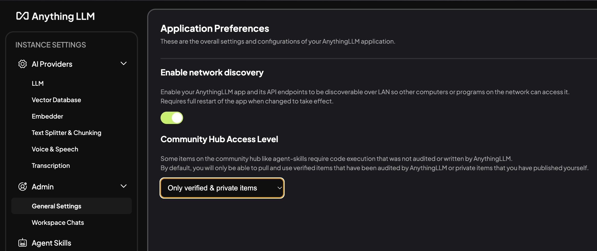
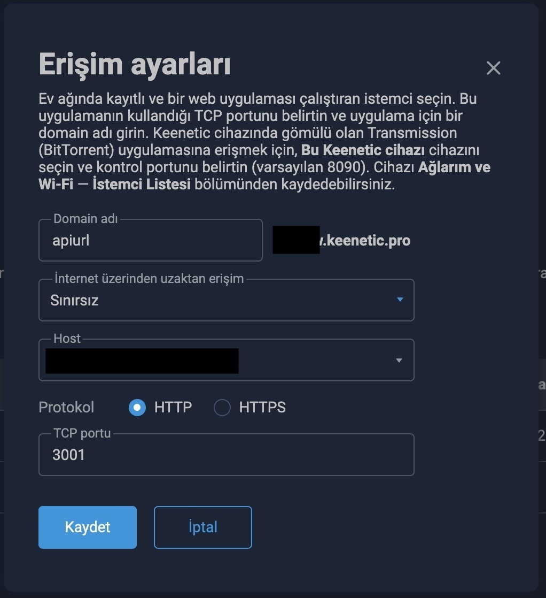
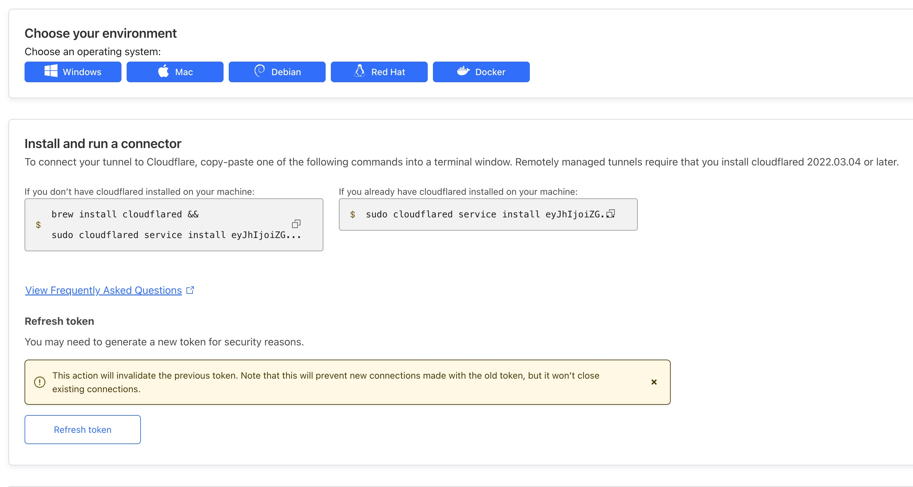
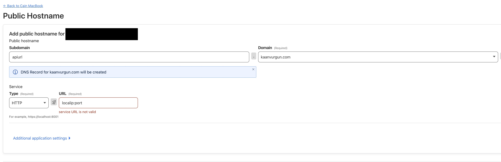
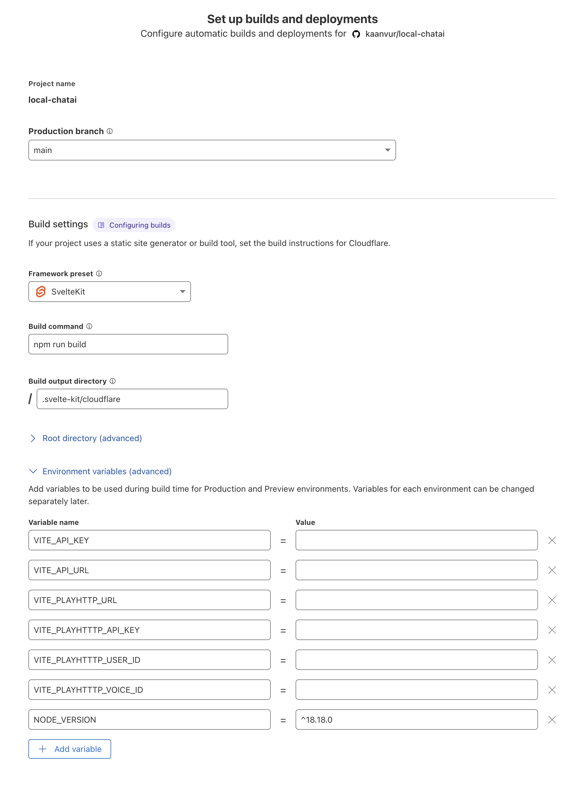

# Local ChatGPT - Sohbet Botu

herhangi bir endpoint ile uyumlu yapay zeka destekli bir chatbot uygulaması. Local host edilen API kullanarak güvenilir ve hızlı bir şekilde sorulara cevaplar sunar.

## 🌟 Özellikler

- 💬 Açık kaynaklı anlık soru-cevap
- 🔊 Text-to-Speech desteği
- 📝 Markdown formatında yanıtlar
- 💾 LocalStorage ile sohbet geçmişi
- 🔄 Yeniden yanıt üretme
- 📱 Responsive tasarım
- 🌙 Karanlık/Aydınlık tema

## 🛠️ Teknoloji Stack

- **Frontend Framework:** SvelteKit
- **UI Framework:** Shadcn-Svelte
- **Styling:** Tailwind CSS
- **API:** Anything LLM (Local Host)
- **State Management:** Svelte Stores
- **Storage:** LocalStorage
- **Deployment:** Cloudflare Pages

## 📁 Proje Yapısı

```
local-chatai/
├── src/
│   ├── lib/
│   │   ├── components/     # UI bileşenleri
│   │   ├── stores/         # Svelte store'ları
│   │   ├── types/          # TypeScript tipleri
│   │   └── utils/          # Yardımcı fonksiyonlar
│   ├── routes/             # Sayfa rotaları
│   └── app.html           
├── static/                 # Statik dosyalar
├── tests/                  # Test dosyaları
└── vite.config.js         # Vite yapılandırması
```

## ⚙️ Temel Fonksiyonlar

1. **Sohbet Yönetimi**
   - Yeni sohbet başlatma
   - Sohbet geçmişi kaydetme
   - Mesaj gönderme/alma

2. **AI Entegrasyonu**
   - OpenAI API bağlantısı
   - Prompt yönetimi
   - Yanıt formatlama

3. **Ses Özellikleri**
   - Text-to-Speech
   - Ses kontrolü
   - Durdurma/Oynatma

4. **PWA Hazır**
   - Uygulama prograssive web app olarak çalışır.
   - Tarayıcıdan desktop ya da mobil uygulama olarak indirilebilir.
   - Hazır şekilde çalışır

5. **Native Mobile Support**
   - Capacitor kütüphanesi eklidir
   - ```pnpm run build:st ya da npm run build:st``` komutu ile mobil uygulamaya dönüştürmeye hazır static çıktı alınabilir.
   - mobil app development için devamı [buradan](https://capacitorjs.com/docs/getting-started#initialize-your-capacitor-config) dökümantasyondan takip edilebilir.
   - ios için xcode, android için android studio ile mobil uygulamaya dönüştürme işlemi yapılarak mobil cihazlarda çalıştırılabilir.

## 🚀 Kurulum

```bash
# Repoyu klonla
git clone https://github.com/kvurgun/local-chatai.git

# Bağımlılıkları yükle
npm install

# Geliştirme sunucusunu başlat
npm run dev

# Üretime hazır build
npm run build
```

## 🔧 Yapılandırma

1. `.env` dosyası oluşturun:
```env
API_KEY= your local device api key
API_URL= your local device url for api
PUBLIC_API_URL= your deployed api url for static files
PLAYHTTP_URL= your tts service url (exp: https://play.ht/)
PLAYHTTTP_API_KEY=your_playhttp_api_key
PLAYHTTTP_USER_ID=your_playhttp_user_id
PLAYHTTTP_VOICE_ID=your_playhttp_voice_id
```

## 🤖 Local LLM Model API
### Local LLM Model API Ayarları
1. Modelinizi çalıştırdığınzı sunucuda (AnythingLLM, LM Studo, Open WebUi, v.s.):
  - 
### Keenetic Modem Ayarları
2. Keenetic Modem ayarları için aşağıdaki adımları izleyin:
  - Keenetic Modem'a bağlanın. (192.168.1.1)
  - Network Rules  > Domain names altından bir domain adı ekleyin
  - Network Rules  > Domain names > add
  - 
### Cloudflare Ayarları
2. Cloudflare tunnel ayarları için aşağıdaki adımları izleyin:
  - Cloudflare üzergiden domain adınızı ekleyin.
  - Cloudflare dashboard'a gidin.
  - Tunnel > Create a tunnel
  - Cloudflared seçeneğini seçin.
  - 
  - işletim sisteminize uygun cloudflared komutunu çalıştırın.
  - Public Hostname alanına domain adınıza subdomain ekleyin. (örnek: apiurl.yourdomain.com)
  - service kısımına local ip ve port numarasını girin.
  - 
## Development
### Tailwind
### SvelteKit
### Shadcn
### Capacitor
## 💻 Deployment
### Cloudflare Ayarları
1. Cloudflare > Compute (Workers) > Workers & Pages sayfasına gidin.
2. Sayfanın üstündeki "Create" butonuna tıklayın.
3. Pages sekmesine tıklayın ve "Connect to Git" butonuna tıklayın. buradan github hesabınızı bağlayın ve projenizi seçin. ya da proje dosyalarını "upload assets" kısmından yükleyin.
4. Burada proje isminizi girin size proje isminizde bir development url verecektir ayarları da yapın ve "Deploy Site" butonuna tıklayın.
5. 

## 📝 Lisans

MIT License - Detaylar için LICENSE dosyasına bakın.

## 🔗 Bağlantılar